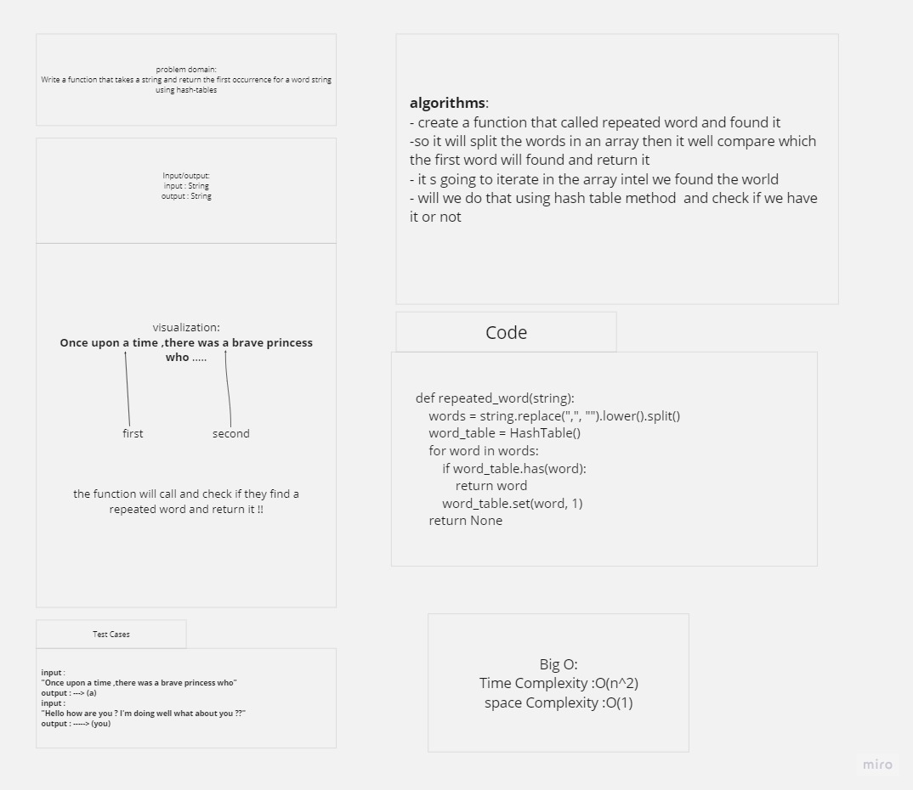

# Hash_Table_repated_word 

## Author : Muhammad AL-Sad

### How to initialize/run your application:

    - cd --> hashtable.py
    - python hashtable.py

### Testing :

    - pytest

### White Borading 

